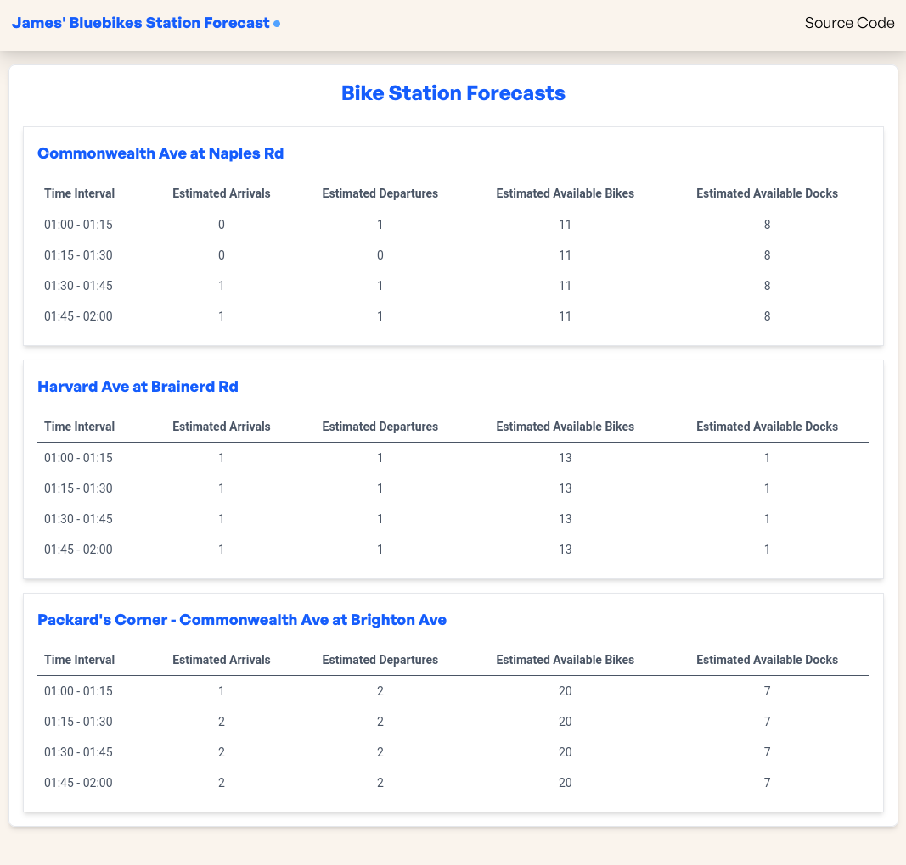
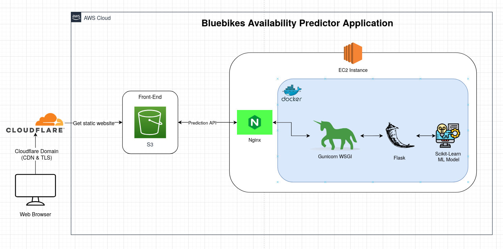

# Available Bluebikes Predictor

An application for making future predictions of the number of Bluebikes that will be available at 3 stations near my apartment in Boston using machine learning.

See application [here](https://bluebikespredictor.jyylab.com).

## Preview

## Project Motivation

I use Bluebikes regularly to get around. However, at times there are no available blue bikes in specific stations. So, I made this project for fun and for learning to gain some insights into the commuting patterns for blue bikes near my home and make a predictor so that I know when and which stations are likely to have available bikes when I leave my home.

## Project Info

### Problem Statement

The purpose is to build predictive models that can accurately forecast Bluebike departures from a station and arrivals into a station to estimate the potential number of available Bluebikes in a station.

### Dataset

I will be using Bluebikes trip history data from 2024, as one of the station was just recently opened in mid-December 2023. Unfortunately, I do not believe there is a recorded historical record of number of available bikes in stations, so instead I will rely on building predictive models that forecasts departures and arrivals to make estimates on available Bluebikes in a station.

For weather, I will just be considering temperature and precipitation for now, although I may add other features like wind speed in the future.

Below are the sources to the data:

- [Official Bluebike Historical Trip Dataset](https://bluebikes.com/system-data)
- [Hourly Weather Data](https://open-meteo.com/en/docs/historical-weather-api#latitude=52.52&longitude=13.41&hourly=temperature_2m,precipitation&daily=&models=)

### Prediction Model

I created an arrival and departure prediction model for each station. Each prediction model takes inputs of time (minute, hour, day, month) and weather (temperature and precipitation) to estimate the number of arrivals and departures for each station in intervals.

Using the forecasted arrivals and departures from the models, I can calculate the net flow (arrivals - departures), grab the live number of available bikes in a station from Bluebike's API, then combine these to forecast how many bikes and docks will be available in the next hour.

### API

After building and training the model, I used Flask to create an API to deploy the model. The API takes the inputs needed for the model (ie. minute, hour, temperature, etc), feeds it to the model, and returns the forecasts.

### Front-End

Built a simple React application to display predictions from API.

### Deployment

Used Docker to containerize the Flask API on an EC2 instance and S3 to host the front-end, all deployed with Terraform.

## Web Application Architecture

## ETL Pipeline

Todo, plan on updating model monthly/quarterly so will build data pipeline.
